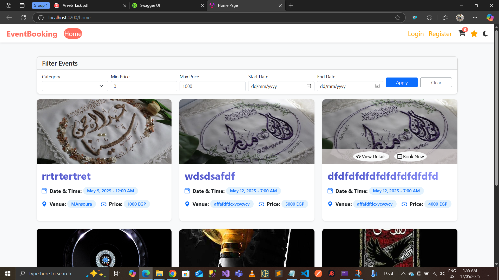
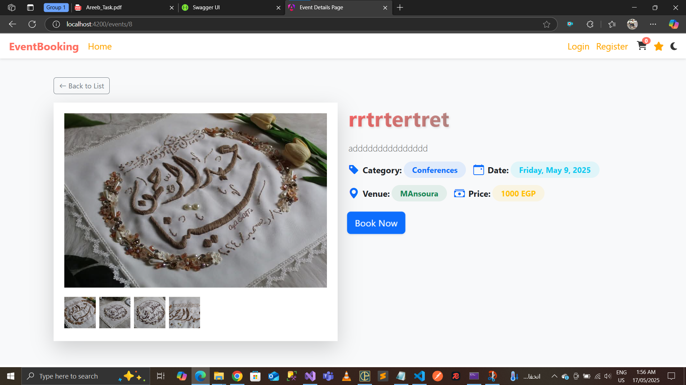
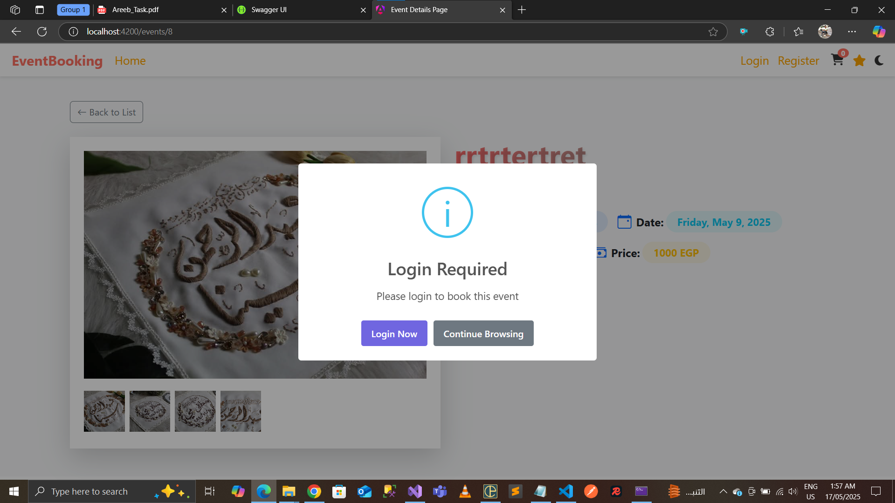
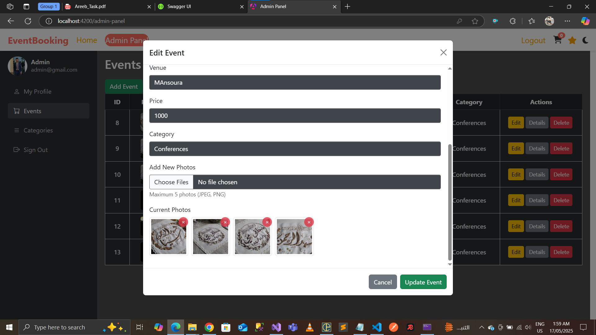
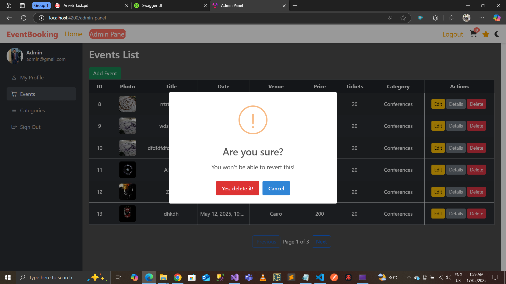
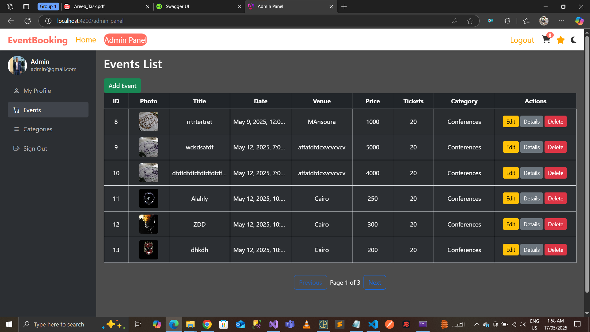
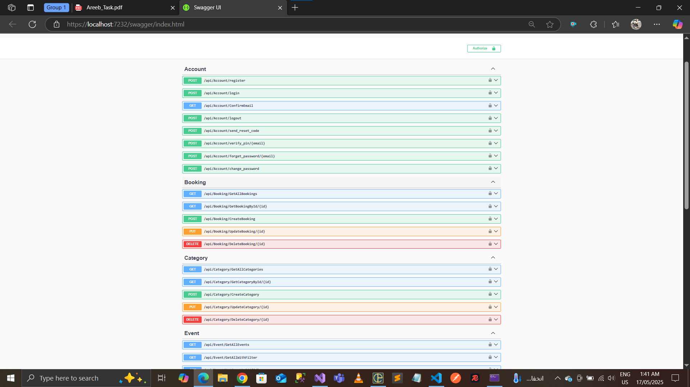
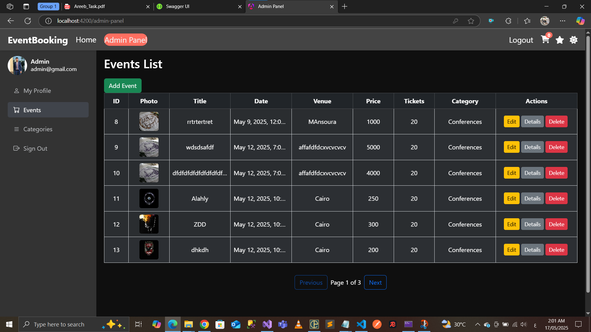

# 🎟️ Event Booking Web App

## 📋 Overview

A full-stack web application for browsing, booking, and managing events.  
Built using **Angular 19** (Frontend) and **.NET 9 Web API** (Backend).

---

## 🧑‍💻 Admin Credentials

> Use these credentials to log in as an administrator:

- **Email**: `admin@gmail.com`  
- **Password**: `Admin@123`

---

## 🔐 Authentication System

- ✅ Fully implemented authentication system with:
  - User Registration
  - Secure Login
  - JWT-based Authorization
  - Role-based Access (Admin / User)
  - Email confirmation required before login
- 📧 **Important**: After registering, a confirmation email will be sent.
  - **Check your Spam folder** if you do not see the email in your inbox.

---

## 🌐 Live Features

### 🏠 Home Page (Event Listings)
- Displays events in a grid or flexbox layout.
- Shows **"Booked"** label for already booked events.
- **"Book Now"** button for available events.
- ✅ **Pagination**: Events are paginated with navigation controls.
- ✅ **Filtering**: Filter events by category, price, date, or keyword.
- ✅ **Dark Mode**: Switch between light and dark themes.

---

### 📄 Event Details Page
- Displays full event info:
  - Name, Description, Category, Date, Venue, Price, and Images
- ✅ Supports uploading **multiple images per event**.
- "Book Now" button books 1 ticket per user click.
- Redirects to **Congratulations** screen after booking.
- No payment integration required.

---

### 🛠️ Admin Panel
- Manage events: **Create, Read, Update, Delete**
- Separate admin interface inside the same web app.
- Admin features include:
  - ✅ Add/Edit/Delete events with **multiple images**
  - ✅ Preview and remove existing images
  - ✅ Full CRUD for **Categories**
- Protected routes using role-based access (`Admin` vs `User`)

---

### 🎨 UI Design
- Web-only interface (No mobile version)
- Clean and modern UI using **Bootstrap 5**
- UI components like alerts, modals, confirmations via **SweetAlert2**
- All admin operations are handled inside **modals**
- ✅ **Dark Mode toggle** included for better accessibility

---
## 📸 Screenshots

### 🏠 Home Page


### 📝 Event Details



### ➕ Add Event
![Add Event]./screenshots/AddEvent.png)

### ✏️ Update Event


### ❌ Delete Event


### 🛠️ Admin Panel


### ⚙️ API (Swagger UI)


### 🌙 Dark Mode

------------------------------------
## 🔗 API Endpoints (Swagger UI)

Full backend documentation available at:

```
https://localhost:7232/swagger/index.html
```

### 📦 Main Modules:
- `Account`: Register, Login, Email Confirmation, Reset Password
- `Booking`: Book event, view booking list, cancel booking
- `Category`: Manage event categories
- `Event`: Full CRUD + image handling + filters

---

## ⚙️ Technologies

### Backend (.NET 9)
- ASP.NET Core Web API
- Entity Framework Core
- ASP.NET Identity + Role Management
- JWT Authentication
- Email Confirmation via SMTP
- Swagger for API testing
- CORS enabled for frontend communication

### Frontend (Angular 19)
- Angular CLI, Lazy Loading
- Bootstrap 5 UI components
- SweetAlert2 for notifications
- Reactive Forms
- HttpClient for API communication
- Guards & Interceptors (Auth handling)
- ✅ **Pagination, Dark Mode, Filtration, Multiple Images**

---

## 🚀 Getting Started

### Backend
```bash
cd backend-folder
dotnet run
```

Ensure the DB connection string is correct and apply EF Migrations.

### Frontend
```bash
cd frontend-folder
npm install
ng serve
```

Visit: [http://localhost:4200](http://localhost:4200)

---

## 📝 Notes

- After registering, you must confirm your email before logging in.
- Confirmation emails may go to **Spam** folder.
- All API calls are secured with **JWT tokens**.
- Image uploading supports **multiple images per event**.
- Admin functionalities are protected and only accessible to Admin role.

---

## 📬 Contact

For any questions or suggestions, feel free to contact.

